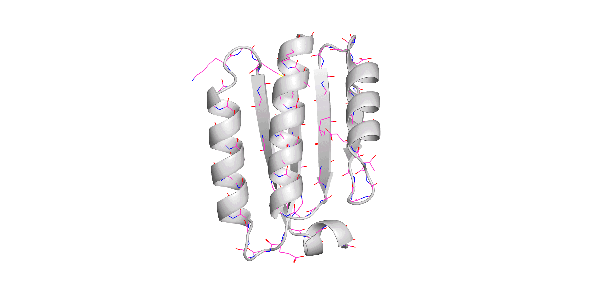
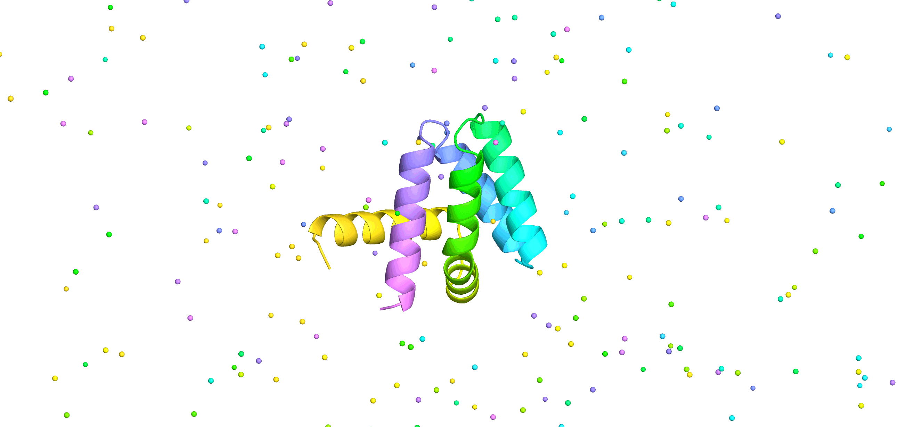

# Full-atom MPNN
Official repository for Full-atom MPNN (FAMPNN), a sequence design method that explicitly models both sequence identity and sidechain conformation.

This repository contains code for full-atom sequence design, sidechain packing, and mutation scoring.



# Installation
To run the scripts in this repository, we recommend using a conda environment. First, clone this repository and navigate to the root directory. Then run the following commands:
```
conda create -n fampnn python=3.10
conda activate fampnn
conda env update --file environment.yaml
pip install -e .
```

Then, to install pytorch with GPU support, follow instructions from https://pytorch.org/get-started/locally/ for your system and CUDA version. We used PyTorch 2.4.1 with CUDA 12.1 for our experiments.

## Model weights
We provide the following weights under `weights/` for FAMPNN:

| Model | Weights | Description |
| ----- | ------- | ----------- |
| FAMPNN (0.0Å) | `fampnn_0_0.pt` | Trained on the full PDB dataset with 0.0Å noise. |
| FAMPNN (0.3Å) | `fampnn_0_3.pt` | Trained on the full PDB dataset with 0.3Å noise. Recommended for sequence design. |
| FAMPNN (0.3Å, CATH) | `fampnn_0_3_cath.pt` | Trained on the CATH dataset with 0.3Å noise. Recommended for mutation scoring. |

# Usage
Example scripts are provided under `examples/scripts/` for sequence design, sidechain packing, and mutation scoring.

## Sequence design

### Unconditional sequence design
To design a sequence for a given list of backbones, use `fampnn/inference/seq_design.py`.

This script takes in a `pdb_dir` with PDB files (and optionally a `pdb_key_list` to subset to certain PDBs) and will design `num_seqs_per_pdb` sequences for each PDB. The number of sampling steps can be adjusted with `timestep_schedule.num_steps` (defaults to 100).

An example of sequence design on a small set of RFdiffusion-generated de novo backbones is provided in `examples/scripts/seq_design_unconditional.sh`.

### Conditional sequence design
FAMPNN can also condition on arbitrary mixtures of sequence-only and sequence-and-sidechain context. To condition on specific amino acid types and sidechains, supply a CSV to `fixed_pos_csv`. A row of the CSV might look like:
```
3e1r,"A165-190,A200-210","A170-180"
```
where the first column specifies the PDB file name (without extension), the second column specifies the sequence positions in the PDB to condition on, and the third column specifies the sidechains from the input PDB to condition on. Fixed sidechain positions must be a subset of fixed sequence positions, since it does not make sense to condition on a sidechain without conditioning on its sequence identity. If a particular column is empty, the script will assume no fixed positions for that context. If `fixed_pos_csv` is not provided, the script will perform unconditional sequence design using backbone-only context.

For example, the row above specifies that sequence design should condition on the sequence from 3e1r.pdb at positions 165-190 and 200-210 in chain A, and the sidechains at positions 170-180. An example of sequence design with conditional context is provided in `examples/scripts/seq_design_conditional.sh`.

## Sidechain packing
To pack sidechains onto a given backbone, use `fampnn/inference/pack.py`.

This script takes in a `pdb_dir` with PDB files (and optionally a `pdb_key_list` to subset to certain PDBs) and will pack sidechains onto the given backbones. By default, if `fixed_pos_csv` is not provided, the script will perform sidechain packing assuming full sequence context but no sidechain context. If fixed sequence positions are specified, the model will only pack those provided positions. An example of sidechain packing with fixed positions is provided in `examples/scripts/pack.sh`. Packed structures also feature a per-atom confidence score stored in the B-factor column of a PDB, which can be visualized in a PyMOL session.



## Mutation scoring
To score specific mutations for a given PDB, use `fampnn/inference/score_multi.py`.

This script requires a `mutations_path` to a 1-column CSV file with the mutations to score. An example of mutation scoring is provided in `examples/scripts/score_multi.sh`.

To score all possible mutations for a given PDB, use `fampnn/inference/score_all_muts.py`. This script will output a CSV with each position mutated to all 19 other amino acids, along with the predicted score for each mutation. An example of scoring all mutations is provided in `examples/scripts/score_all_muts.sh`.

